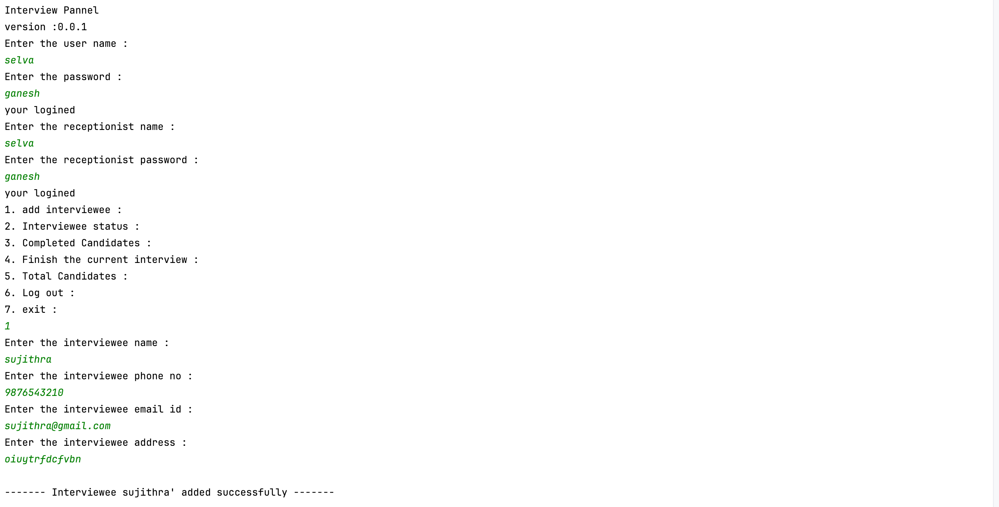
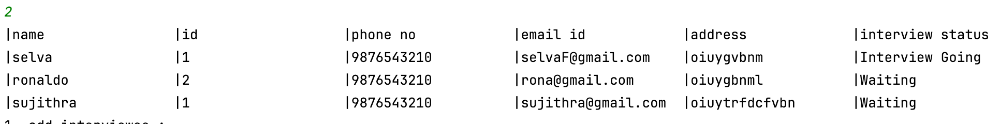
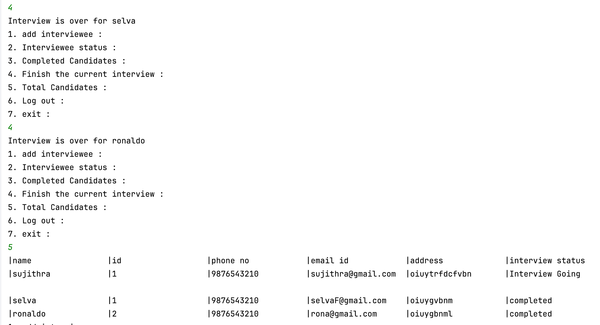

# INTERVIEW PANNEL CONSOLE APPLICATION :

This is interview pannel console application implemented in Java. It allows receptionist to add interviewee, see interviewee status , see completed candidates, finish the current interview and see total candidates.

# DEVELOPED USING :

**IDE** : Intellij idea community edition.

**LANGUAGE** : Java

**EXTERNAL LIBRARY** : GSON (for json serialization and deserialization).

# FEATURES :

- **INTERVIEW PANNEL MENU :**
  - add interviewee
  - Interviewee status 
  - Completed Candidates
  - Finish the current interview
  - Total Candidates
  - Log out
  - exit

# SCREEN SHOTS :

# PATTERNS FOLLOWED :

- **view model :** Model-view (MV) is a software design pattern that separates an application's logic into two distinct layers:
   - *Model:* Stores and retrieves data from back-end data stores
   - *View:* Provides the user interface (UI) necessary to interact with the application
- **Singleton :** The singleton pattern is a software design pattern that restricts the instantiation of a class to a single instance. It provides access to that instance from anywhere in the codebase. The singleton pattern is useful when multiple instances of a class are undesirable or a single point of control or coordination is required.
